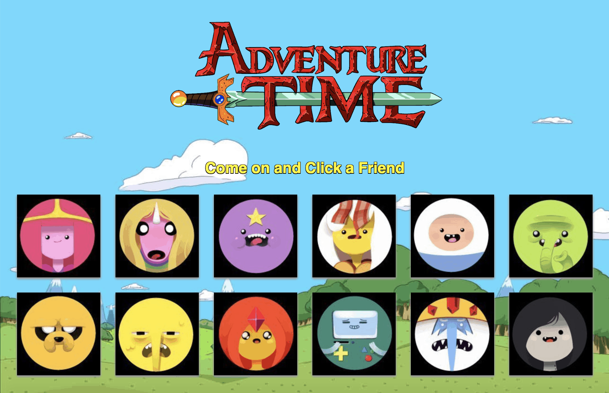

# Adventure Time Memory-Game

[Live Demo]()

- - -

## Overview

This project uses the [Reactjs](https://reactjs.org/) framework to set and monitor application state and record user actions and "React" accordingly. Unlike previous games that relied upon global variables and custom functions, this project uses the component structure model where as much aspects of the app were divided into various server components and rendered together in the browser for a fast and efficent user experience. 

### Instructions

1. Behold 12 colorful cards of Adventure Time friends from the Land of Ooo!

2. Clicking on a friend that has NOT been clicked on before will increase the users score by one point and randomly shuffle the friends.

3. Clicking on a friend that HAS been clicked on results in a "Game Over" alert and automatically starts a new game.

4. If the user can click on all friends only once (and hence get a perfect score of 12) they win!

- - -

